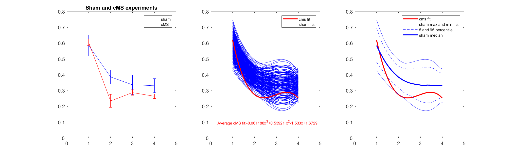
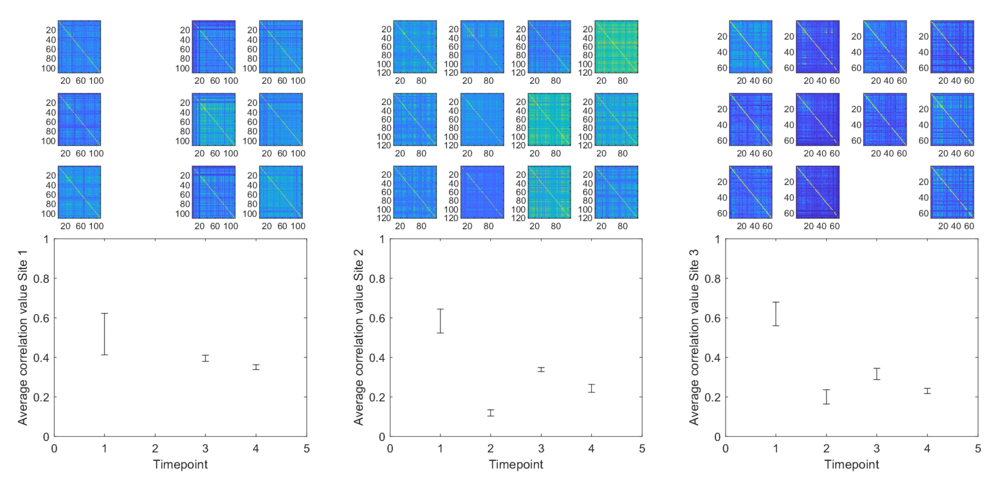

# Jafari-et-al-2020
Code and sample data used for parts of the analysis in the paper Jafari et al 2020.

The matlab file *cubic_fitting_bootstrapping.m* loads the data from the file *summary_data.xlsx* to produce the figure below.

The matlab file *correlation example.m* loads the data from the four excel files *032412\*.xlsx* to produce the figure below.

