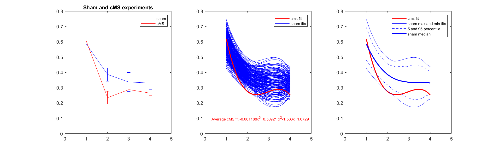
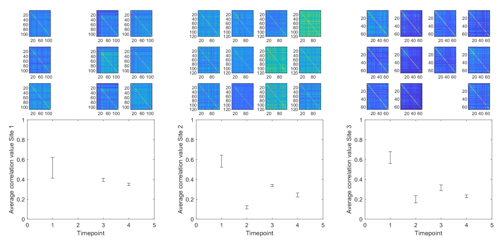

## Correlation analysis

The matlab file *cubic_fitting_resampling.m* loads the data from the file *summary_data.xlsx* to produce the figure below.

---

The matlab file *correlation example.m* loads the data from the four excel files *sample1_\*.xlsx* to produce the figure below.

---

